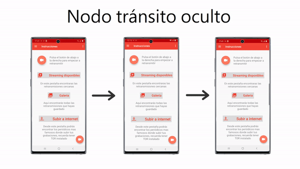

# CrowdStreaming - A Wifi Aware application

This application allows you to broadcast your device's camera and microphone via Wifi Aware.

CrowdStreaming is licensed under the [MIT License](https://github.com/davidsalido/CrowdStreaming/blob/master/LICENSE)

## Authors

- David Salido Camacho: https://github.com/davidsalido
- Francisco Calero: https://github.com/FCalero
- Sergio Manzanaro Caraballo: https://github.com/SergioManzanaro

## Usage example

  

  

  

  

